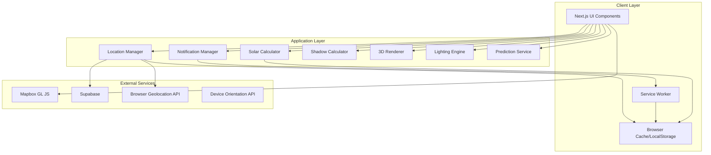

# Design Document

## Overview

The Sun Tracking Web Application is built as a Next.js 15 progressive web app (PWA) that provides real-time solar position calculations, interactive visualizations, and location-based services. The architecture follows a modular approach with clear separation between calculation engines, UI components, data management, and external service integrations.

The system leverages modern web APIs including Geolocation, Device Orientation, Web Push Notifications, and Service Workers to deliver a native-like mobile experience while maintaining cross-platform compatibility.

## Architecture

### High-Level Architecture



### Technology Stack

- **Frontend Framework**: Next.js 15 with App Router
- **Styling**: SCSS modules with responsive design system
- **Maps**: Mapbox GL JS for interactive mapping
- **Database**: Supabase for user data and location storage
- **Authentication**: Supabase Auth
- **Notifications**: Web Push API with Service Worker
- **PWA**: Service Worker for offline functionality
- **Calculations**: Custom JavaScript implementation of NOAA algorithms
- **3D Graphics**: Three.js for WebGL-based 3D rendering and lighting
- **3D Models**: GLTF/GLB format for human model assets
- **Lighting**: Physically-based rendering (PBR) for realistic sun lighting effects

## Components and Interfaces

### Core Calculation Engine

#### Solar Calculator (`/src/lib/solar-calculator.js`)
```javascript
interface SolarCalculator {
  calculateSunPosition(latitude, longitude, date): {
    azimuth: number,
    elevation: number,
    distance: number
  }
  
  calculateSunTimes(latitude, longitude, date): {
    sunrise: Date,
    sunset: Date,
    solarNoon: Date,
    goldenHourStart: Date,
    goldenHourEnd: Date,
    blueHourStart: Date,
    blueHourEnd: Date
  }
  
  generateSunPath(latitude, longitude, date): Array<{
    time: Date,
    azimuth: number,
    elevation: number
  }>
}
```

#### Shadow Calculator (`/src/lib/shadow-calculator.js`)
```javascript
interface ShadowCalculator {
  calculateShadowLength(objectHeight, sunElevation): number
  calculateShadowDirection(sunAzimuth): number
  getShadowEndpoint(startPoint, length, direction): {
    latitude: number,
    longitude: number
  }
}
```

#### 3D Renderer (`/src/lib/3d-renderer.js`)
```javascript
interface 3DRenderer {
  initializeScene(container: HTMLElement): void
  loadHumanModel(modelPath: string): Promise<void>
  updateSunPosition(azimuth: number, elevation: number): void
  updateLighting(sunIntensity: number, ambientLevel: number): void
  renderFrame(): void
  setCamera(position: Vector3, target: Vector3): void
  dispose(): void
}
```

#### Lighting Engine (`/src/lib/lighting-engine.js`)
```javascript
interface LightingEngine {
  calculateSunIntensity(elevation: number, atmosphericConditions?: object): number
  createDirectionalLight(azimuth: number, elevation: number, intensity: number): DirectionalLight
  updateShadows(sunPosition: object, sceneObjects: Array): void
  calculateAmbientLight(timeOfDay: Date, weather?: string): number
  applyAtmosphericScattering(sunPosition: object): Color
}
```

#### Prediction Service (`/src/lib/prediction-service.js`)
```javascript
interface PredictionService {
  generateFutureSunData(latitude: number, longitude: number, startDate: Date, endDate: Date): Promise<Array<SunData>>
  predictSeasonalChanges(latitude: number, longitude: number, year: number): SeasonalData
  calculateLightingTrends(location: object, timeRange: object): Array<LightingTrend>
  compareLightingConditions(date1: Date, date2: Date, location: object): ComparisonData
}
```

### Location Management

#### Location Manager (`/src/lib/location-manager.js`)
```javascript
interface LocationManager {
  getCurrentLocation(): Promise<{latitude, longitude, accuracy}>
  validateCoordinates(latitude, longitude): boolean
  saveLocation(name, latitude, longitude): Promise<void>
  getSavedLocations(): Promise<Array<SavedLocation>>
  deleteLocation(id): Promise<void>
}

interface SavedLocation {
  id: string
  name: string
  latitude: number
  longitude: number
  createdAt: Date
}
```

### UI Components

#### Main Layout Structure
```
/src/app/
├── layout.js                 # Root layout with navigation
├── page.js                   # Home screen with sun summary
├── map/page.js              # Interactive map view
├── compass/page.js          # Compass overlay view
├── 3d-view/page.js          # 3D visualization with human model
├── predictions/page.js      # Future sun predictions view
├── locations/page.js        # Saved locations management
├── settings/page.js         # App settings and preferences
└── components/
    ├── SunSummaryCard.js    # Current sun position display
    ├── TimeScrubber.js      # Interactive time control
    ├── MapView.js           # Mapbox integration
    ├── CompassOverlay.js    # Device orientation compass
    ├── 3DVisualization.js   # Three.js 3D scene component
    ├── HumanModel.js        # 3D human model with lighting
    ├── PredictionTimeline.js # Future sun predictions interface
    ├── NotificationSettings.js
    └── ShadowCalculator.js
```

#### Key Component Interfaces

**TimeScrubber Component**
```javascript
interface TimeScrubberProps {
  currentTime: Date
  onTimeChange: (newTime: Date) => void
  minTime: Date
  maxTime: Date
  sunTimes: SunTimes
}
```

**MapView Component**
```javascript
interface MapViewProps {
  center: {latitude: number, longitude: number}
  sunPath: Array<SunPathPoint>
  currentSunPosition: {azimuth: number, elevation: number}
  onLocationSelect: (coordinates) => void
  selectedTime: Date
}
```

**3DVisualization Component**
```javascript
interface 3DVisualizationProps {
  sunPosition: {azimuth: number, elevation: number}
  sunIntensity: number
  selectedTime: Date
  onTimeChange: (newTime: Date) => void
  showPredictions: boolean
  predictionData?: Array<FutureSunData>
}
```

**PredictionTimeline Component**
```javascript
interface PredictionTimelineProps {
  currentDate: Date
  predictionRange: {start: Date, end: Date}
  onDateSelect: (date: Date) => void
  lightingData: Array<LightingTrend>
  comparisonMode: boolean
}
```

## Data Models

### User Data Schema (Supabase)

```sql
-- Users table (handled by Supabase Auth)
CREATE TABLE users (
  id UUID PRIMARY KEY DEFAULT gen_random_uuid(),
  email TEXT UNIQUE NOT NULL,
  created_at TIMESTAMP WITH TIME ZONE DEFAULT NOW()
);

-- Saved locations
CREATE TABLE saved_locations (
  id UUID PRIMARY KEY DEFAULT gen_random_uuid(),
  user_id UUID REFERENCES users(id) ON DELETE CASCADE,
  name TEXT NOT NULL,
  latitude DECIMAL(10, 8) NOT NULL,
  longitude DECIMAL(11, 8) NOT NULL,
  created_at TIMESTAMP WITH TIME ZONE DEFAULT NOW(),
  updated_at TIMESTAMP WITH TIME ZONE DEFAULT NOW()
);

-- Notification preferences
CREATE TABLE notification_preferences (
  id UUID PRIMARY KEY DEFAULT gen_random_uuid(),
  user_id UUID REFERENCES users(id) ON DELETE CASCADE,
  location_id UUID REFERENCES saved_locations(id) ON DELETE CASCADE,
  golden_hour_enabled BOOLEAN DEFAULT true,
  blue_hour_enabled BOOLEAN DEFAULT false,
  notification_minutes_before INTEGER DEFAULT 30,
  created_at TIMESTAMP WITH TIME ZONE DEFAULT NOW()
);
```

### Client-Side Data Models

```javascript
// Application state management
interface AppState {
  currentLocation: {
    latitude: number,
    longitude: number,
    name?: string
  },
  selectedDate: Date,
  selectedTime: Date,
  sunData: {
    position: {azimuth: number, elevation: number},
    times: SunTimes,
    path: Array<SunPathPoint>
  },
  userPreferences: {
    units: 'metric' | 'imperial',
    timeFormat: '12h' | '24h',
    mapStyle: string,
    theme: 'light' | 'dark'
  }
}
```

## Error Handling

### Error Categories and Responses

1. **Geolocation Errors**
   - Permission denied: Show manual location input
   - Position unavailable: Fallback to IP-based location
   - Timeout: Retry with increased timeout, then fallback

2. **Network Connectivity**
   - Offline mode: Use cached data and localStorage
   - API failures: Show cached results with staleness indicator
   - Supabase connection issues: Queue operations for retry

3. **Device API Errors**
   - Orientation API unavailable: Show static compass
   - Notification permission denied: Hide notification features
   - Service Worker registration failure: Graceful PWA degradation

4. **Calculation Errors**
   - Invalid coordinates: Show validation message and prevent calculation
   - Date out of range: Clamp to supported date range
   - Polar region edge cases: Show appropriate warnings

### Error Recovery Strategies

```javascript
// Example error handling pattern
class LocationService {
  async getCurrentLocation() {
    try {
      return await this.getBrowserLocation();
    } catch (error) {
      if (error.code === 1) { // Permission denied
        return await this.getIPLocation();
      } else if (error.code === 2) { // Position unavailable
        throw new LocationError('Unable to determine location', 'LOCATION_UNAVAILABLE');
      }
    }
  }
}
```

## Testing Strategy

### Unit Testing
- **Solar calculations**: Test against NOAA reference data for accuracy
- **Coordinate validation**: Test edge cases including polar regions
- **Time zone handling**: Validate DST transitions and international date line
- **Shadow calculations**: Verify mathematical accuracy with known values

### Integration Testing
- **Geolocation flow**: Test permission handling and fallback mechanisms
- **Supabase operations**: Test CRUD operations for locations and preferences
- **Map integration**: Test Mapbox rendering and interaction events
- **Notification system**: Test web push registration and delivery

### Browser Compatibility Testing
- **Device Orientation API**: Test across iOS Safari, Android Chrome, desktop browsers
- **Service Worker**: Validate PWA functionality and offline capabilities
- **Geolocation accuracy**: Test on various devices and network conditions

### Performance Testing
- **Calculation performance**: Benchmark sun position calculations for real-time updates
- **Memory usage**: Monitor for memory leaks during continuous orientation tracking
- **Bundle size**: Optimize for fast loading on mobile networks

## Security Considerations

### Data Privacy
- Location data stored locally by default
- Optional cloud sync with explicit user consent
- No tracking or analytics without user permission
- Supabase RLS policies for user data isolation

### API Security
- Mapbox API key restrictions by domain
- Supabase anon key with appropriate RLS policies
- Rate limiting for calculation-intensive operations
- Input validation for all user-provided coordinates

### PWA Security
- HTTPS requirement for all features
- Service Worker scope limitations
- Secure notification payload handling
- Content Security Policy implementation

## Performance Optimization

### Calculation Optimization
- Cache sun path calculations for repeated date/location queries
- Debounce real-time updates during time scrubbing
- Pre-calculate common sun times for current location
- Use Web Workers for intensive calculations if needed

### Rendering Optimization
- Virtualize long lists of saved locations
- Optimize Mapbox layer rendering for smooth animations
- Use CSS transforms for compass rotation
- Implement proper React key strategies for list updates

### Network Optimization
- Service Worker caching for offline functionality
- Compress and optimize map tiles
- Batch Supabase operations where possible
- Implement proper loading states and skeleton screens

### Mobile Optimization
- Touch-friendly interface with appropriate target sizes
- Optimize for various screen sizes and orientations
- Minimize battery usage during continuous orientation tracking
- Implement proper viewport meta tags for mobile browsers